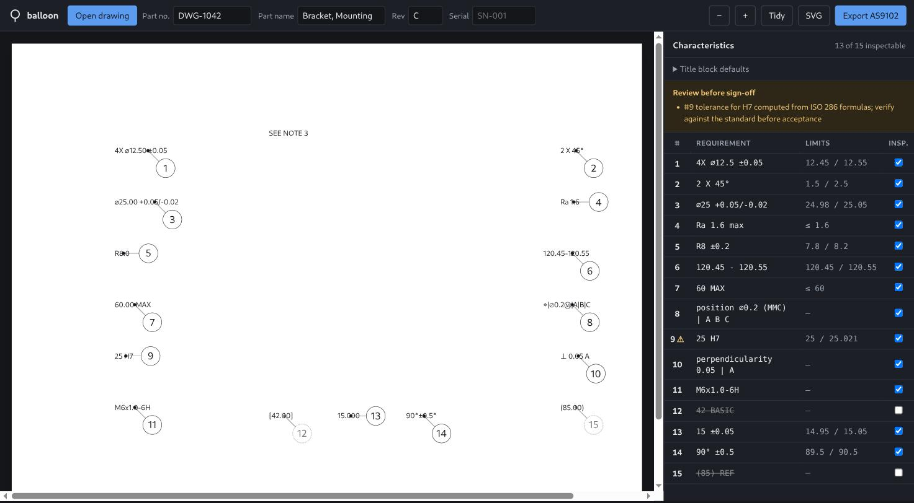

# balloon

Turns an engineering drawing into a numbered inspection sheet.

Every machined part ships with a **First Article Inspection Report**: a table
listing each dimension on the drawing, its tolerance, and the measured value. To
build it, someone prints the drawing, hand-draws numbered bubbles ("balloons")
on every dimension, and retypes each one into a spreadsheet. Then the customer
issues revision D and they do it again.

This does the mechanical parts: read the callouts, work out what each one
actually tolerances, number them in reading order, place the balloons, and write
the AS9102 form.



Open a drawing PDF, drag balloons that landed badly, tick off what doesn't need
inspecting, export. The PDF never leaves the machine — pdf.js parses it in the
browser and only the extracted text runs are sent to the local server.

## Quick start

```bash
go build -o bin/balloon ./cmd/balloon
./bin/balloon serve          # then open http://localhost:8080
```

That's the whole install. pdf.js is vendored, so there is no npm, no build step
and no network access at runtime — one Go binary with the frontend embedded.

No drawing to hand? Click **Load the demo part**.

There's a CLI too, for driving the engine without a browser:

```bash
./bin/balloon parse '4X ⌀12.50 ±0.05' '25 H7' '⌖|⌀0.2Ⓜ|A|B|C'
./bin/balloon demo -o demo.svg          # render a ballooned drawing
./bin/balloon demo -o demo.svg -debug   # show text boxes and obstacle regions
go test ./...
```

## The interesting parts

**Callouts are a mess.** The same diameter symbol arrives as `⌀` (U+2300), `Ø`
(U+00D8), `ϕ`, or the literal string `%%c` if the drawing came out of AutoCAD.
GD&T symbols often arrive as bare ASCII letters, because the drawing used a
symbol font and the PDF text layer kept the character codes rather than the
glyphs — so a position symbol reaches you as the letter `j`.

**PDF text layers split callouts apart.** `⌀12.50` and ` ±0.05` almost always
arrive as separate runs. Hand those halves to a parser separately and you get
two useless characteristics instead of one correct one, so runs sharing a
baseline with only a small gap between them are stitched back together first.

**A dimension with no tolerance is not untoleranced.** `12.50` inherits from the
title block, and *which* default depends on how many decimal places were typed.
Parsing the number without that context produces a characteristic nobody can
measure against.

**`25 H7` carries its tolerance in a letter.** Resolving it means computing the
ISO 286 standard tolerance factor for the size band, applying the IT grade
multiplier, then positioning that width using the fundamental deviation for the
letter. The result is `+0.021 / 0`. This is implemented from the standard's
formulas and verified against published tables — and every value it produces
carries a warning, because ISO rounds its tabulated figures and a computed
acceptance limit should not be signed off without a check.

**Most of the text isn't dimensions.** Filtering on "contains a number" keeps
`SEE NOTE 3` and `SHEET 1 OF 2`. The demo ballooned the first one as a 3 mm
dimension until that was fixed.

**Placing the balloons is a constrained-optimisation problem.** A bubble should
sit near its feature, off the geometry, clear of other bubbles, with a leader
that doesn't cross another leader. On a dense drawing those goals conflict, so
the solver scores candidate positions and takes the least-bad arrangement —
weighting a balloon collision far above a long leader, because an unreadable
number is worse than an ugly one. When there is genuinely no clean answer it
still returns a position and says what's wrong with it, rather than failing or
quietly overlapping. Those balloons are tinted amber so a human knows to drag
them.

Placement is deterministic, so re-running against a revised drawing shows a
reviewer only the balloons that actually moved.

**Warnings reach the sheet, not just the screen.** Anything the pipeline could
not fully resolve is printed on the exported workbook under "Review before
sign-off". A warning that lives only in the UI is one the person signing the
report never sees.

## What it produces

An AS9102 Form 3 — *Characteristic Accountability, Verification and
Compatibility Evaluation* — with the Results column left empty for the
inspector:

```
Char. │ Ref.    │ Desig. │ Requirement          │ Acceptance Limits │ Results
──────┼─────────┼────────┼──────────────────────┼───────────────────┼────────
  1   │ Sheet 1 │        │ 4X ⌀12.5 ±0.05       │ 12.45 / 12.55     │
  2   │ Sheet 1 │        │ 2 X 45°              │ 1.5 / 2.5         │
  4   │ Sheet 1 │        │ Ra 1.6 max           │ ≤ 1.6             │
  8   │ Sheet 1 │ GD&T   │ position ⌀0.2 (MMC)  │                   │
  9   │ Sheet 1 │        │ 25 H7                │ 25 / 25.021       │
```

Requirements echo the drawing's own notation rather than a normalised rewrite,
because a customer comparing the report against the print needs to recognise
each row at a glance. Reference and basic dimensions get a balloon but no row —
they're on the drawing, they're just not measured directly.

## Layout

```
internal/dimension/   callout grammar — symbols, tolerances, threads, ISO fits, GD&T
internal/layout/      balloon placement solver and the geometry it needs
internal/model/       the pipeline: text in, numbered inspection sheet out
internal/export/      AS9102 Form 3 as XLSX
internal/render/      SVG output
internal/api/         HTTP handlers, stateless
internal/demo/        the synthetic fixture both the CLI and the browser use
web/                  frontend (vanilla JS + vendored pdf.js), embedded in the binary
cmd/balloon/          CLI: parse, demo, build, serve
```

`internal/dimension` and `internal/layout` depend on nothing else in the
project, including each other. The pipeline is the only thing that knows both
exist. The server is stateless — the browser holds the drawing and posts it back
for each operation, so there's no database and nothing left behind when you
close it.

## Known limitations

- ISO fit values are computed, not tabulated, and can differ from the published
  table by about 1 µm (`10 H7` computes 14 µm against a book value of 15). They
  are always flagged. Fundamental deviations are implemented for H, h, js, g, f,
  e and d; other letters return unresolved rather than guessing.
- The prose filter is a vocabulary allowlist. It will drop a legitimate callout
  containing an unusual abbreviation, which is the safer direction to fail but
  is still a failure.
- Leader lines terminate at the centre of the callout's text box rather than at
  the feature itself. Dragging the balloon moves the bubble, not the leader's
  anchor point.
- **A drawing with no text layer produces nothing.** Scanned prints and
  vector-only exports need OCR, which isn't here.
- Only the first sheet is exported to SVG; the XLSX covers every sheet.

## Licence

MIT for this project. Vendored pdf.js is Apache 2.0 — see
`web/vendor/LICENSE-pdfjs`.
