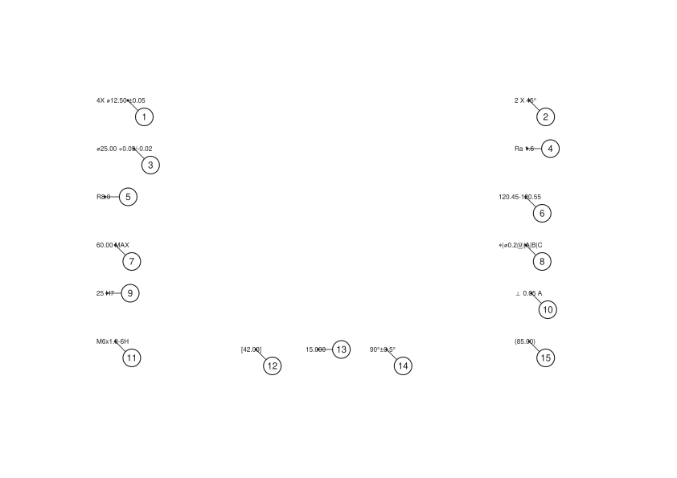

# balloon

Turns an engineering drawing into a numbered inspection sheet.

Every machined part ships with a **First Article Inspection Report**: a table
listing each dimension on the drawing, its tolerance, and the measured value. To
build it, someone prints the drawing, hand-draws numbered bubbles ("balloons")
on every dimension, and retypes each one into a spreadsheet. Then the customer
issues revision D and they do it again.

This does the mechanical parts: read the callouts, work out what each one
actually tolerances, number them in reading order, and place the balloons.



```
$ balloon demo -o demo.svg
demo.svg: 15 characteristics, 13 inspectable, 0 need attention

warnings:
  - balloon 9: tolerance for H7 computed from ISO 286 formulas; verify against
    the standard before acceptance
```

## The interesting parts

**Callouts are a mess.** The same diameter symbol arrives as `⌀` (U+2300), `Ø`
(U+00D8), `ϕ`, or the literal string `%%c` if the drawing came out of AutoCAD.
GD&T symbols often arrive as bare ASCII letters, because the drawing used a
symbol font and the PDF text layer kept the character codes rather than the
glyphs — so a position symbol reaches you as the letter `j`.

**A dimension with no tolerance is not untoleranced.** `12.50` inherits from the
title block, and *which* default depends on how many decimal places were typed.
Parsing the number without that context produces a characteristic nobody can
measure against.

**`25 H7` carries its tolerance in a letter.** Resolving it means computing the
ISO 286 standard tolerance factor for the size band, applying the IT grade
multiplier, then positioning that width using the fundamental deviation for the
letter. The result is `+0.021 / 0`. This is implemented from the standard's
formulas and verified against published tables — and every value it produces
carries a warning, because ISO rounds its tabulated figures and a computed
acceptance limit should not be signed off without a check.

**Most of the text isn't dimensions.** Filtering on "contains a number" keeps
`SEE NOTE 3` and `SHEET 1 OF 2`. The demo ballooned the first one as a 3 mm
dimension until that was fixed.

**Placing the balloons is a constrained-optimisation problem.** A bubble should
sit near its feature, off the geometry, clear of other bubbles, with a leader
that doesn't cross another leader. On a dense drawing those goals conflict, so
the solver scores candidate positions and takes the least-bad arrangement —
weighting a balloon collision far above a long leader, because an unreadable
number is worse than an ugly one. When there is genuinely no clean answer it
still returns a position and says what's wrong with it, rather than failing or
quietly overlapping.

Placement is deterministic, so re-running against a revised drawing shows a
reviewer only the balloons that actually moved.

## Try it

```bash
go build -o bin/balloon ./cmd/balloon

# parse callouts straight from the terminal
./bin/balloon parse '4X ⌀12.50 ±0.05' '25 H7' '⌖|⌀0.2Ⓜ|A|B|C'

# render a synthetic ballooned drawing, no input files needed
./bin/balloon demo -o demo.svg
./bin/balloon demo -o demo.svg -debug   # show text boxes and obstacle regions

go test ./...
```

`balloon parse '25 H7'`:

```json
{
  "raw": "25 H7",
  "kind": "linear",
  "nominal": 25,
  "unit": "mm",
  "tol_type": "fit",
  "upper": 0.021,
  "lower": 0,
  "upper_limit": 25.021,
  "lower_limit": 25,
  "fit": { "Deviation": "H", "Grade": 7, "IsHole": true },
  "warnings": [
    "tolerance for H7 computed from ISO 286 formulas; verify against the standard before acceptance"
  ]
}
```

## Layout

```
internal/dimension/   callout grammar — symbols, tolerances, threads, ISO fits, GD&T
internal/layout/      balloon placement solver and the geometry it needs
internal/model/       the pipeline: text in, numbered inspection sheet out
internal/render/      SVG output
cmd/balloon/          CLI
```

`internal/dimension` and `internal/layout` have no dependencies on anything else
in the project, including each other. The pipeline is the only thing that knows
both exist.

## Status

Built and tested:

- callout parser (symmetric, bilateral, limits, MAX/MIN, basic, reference,
  ISO fits, title-block defaults, threads, chamfers, roughness, GD&T frames)
- balloon placement solver
- reading-order numbering
- SVG render
- CLI

Not built yet:

- **PDF ingest.** The pipeline takes text items with coordinates; nothing
  produces them from a real PDF yet. That's the browser frontend's job — PDF.js
  renders the page and hands back positioned text.
- **The editor.** Click to place, drag to adjust, edit a characteristic.
- **AS9102 export.** The XLSX the whole thing is ultimately for.

## Known limitations

- ISO fit values are computed, not tabulated, and can differ from the published
  table by about 1 µm (`10 H7` computes 14 µm against a book value of 15). They
  are always flagged. Fundamental deviations are implemented for H, h, js, g, f,
  e and d; other letters return unresolved rather than guessing.
- The prose filter is a vocabulary allowlist. It will drop a legitimate callout
  containing an unusual abbreviation, which is the safer direction to fail but
  is still a failure.
- Leader lines currently terminate at the centre of the callout's text box. On a
  real drawing they should point at the feature, which is something the editor
  will need to let a human set.
